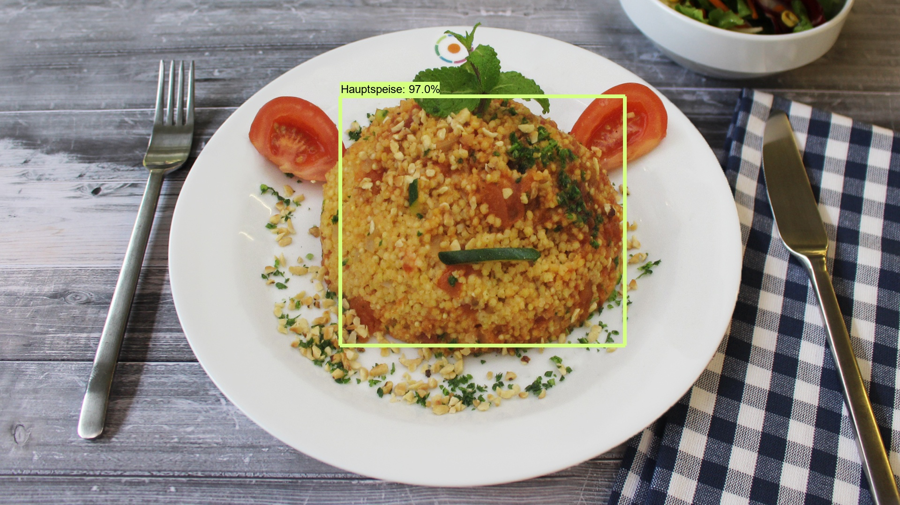

# CoffAI - Cafeteria with AI

## Little Story
We have started this project due to the lecture Applied Artificial Intelligence at Hochschule Esslingen. Our idea was to set up a software system that detects food using Object Detection.
Our project wasn't designed for commercial use, only for educational reasons.

**Special mentions:**  
* [Object-Detection API - Github](https://github.com/tensorflow/models/tree/master/research/object_detection)  
"Speed/accuracy trade-offs for modern convolutional object detectors."  
Huang J, Rathod V, Sun C, Zhu M, Korattikara A, Fathi A, Fischer I, Wojna Z,
Song Y, Guadarrama S, Murphy K, CVPR 2017

* [EdjeElectronics - Github](https://github.com/EdjeElectronics/TensorFlow-Object-Detection-API-Tutorial-Train-Multiple-Objects-Windows-10)

## How to use our project

### Required Installations
* The [Python tensorflow object detection](https://github.com/EdjeElectronics/TensorFlow-Object-Detection-API-Tutorial-Train-Multiple-Objects-Windows-10)
* The webserver Apache inclusive PHP  
(to use a local web server you can install for example [XAMPP](https://www.apachefriends.org/de/index.html) like we did)

### Copy Files for the application interface
[Here]() you can find a directory with the files you need to launch the application interface. You have to copy all files from this directory into your object detection installation path, except the visualization_utils.py. This single file should be saved in the subfolder utils in it.

### Change Paths
If you follow the installation instructions, given on [this page](https://github.com/EdjeElectronics/TensorFlow-Object-Detection-API-Tutorial-Train-Multiple-Objects-Windows-10), you won't have to change any paths.
Otherwise you have to change the BASIC_PATH to your object detection installation path in the Object_detection_image.py.
Uploaded and finished pictures and also the bills will be stored in the object detection directory.
If you want to keep the pictures or the bills in another directory, you will also have to change the corresponding paths in this python file.

When you use XAMPP, you have to change the location of the project files to the object detection installation path by adjust the following two rows in the httpd.conf
>DocumentRoot "C:/xampp/htdocs"  
><Directory "C:/xampp/htdocs">

If you did not name your environment "tensorflow1", you must change it in the Object_detection_Image.bat file.

### Database
To use our database you have to download and install the [Microsoft Drivers for PHP for SQL Server](https://docs.microsoft.com/en-us/sql/connect/php/getting-started-with-the-php-sql-driver?view=sql-server-ver15). You then have to add the DLLs that match the PHP environment to the extensions of your web server.  
For this process in the case of using XAMPP, you have to copy the two matching DLLs to "c:\xampp\php\ext\" and add in the extension section of php.ini these new two extension DLLs

In case of 32 bit:
>extension=php_pdo_sqlsrv_XX_ts_x86.dll  
>extension=php_sqlsrv_XX_ts_x86.dll

In case of 64 bit:
>extension=php_pdo_sqlsrv_XX_ts_x64.dll  
>extension=php_sqlsrv_XX_ts_x64.dll

'XX' in both of the above extension codes stands for e.g. 74 &rarr; 7.4 = version of your PHP environment

Due to the upload size, we have decided to only upload our trained model without the dataset we have used.

### **Additional information about our project can be found on our [hackster entry](https://www.hackster.io/340027/cafeteria-with-artificial-intelligence-cab8bc).**

## Group members

* **Dennis Herzog**
* **Maxim Bickel**
* **Philipp Dobler** - *project manager*
